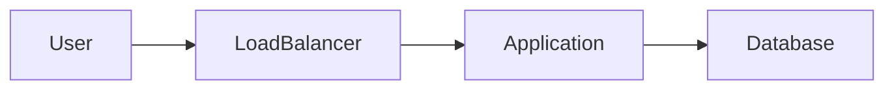

# Style Guide

> This document defines the editorial standards for **System Design Interview Companion**.

The goal is to ensure every page feels like it was written by the same author, regardless of when it was created.

---

# Our Mission

This is **not** a textbook.

This is **not** a documentation site.

This is a concise, interview-focused guide for backend engineers preparing for system design interviews.

Every page should help the reader answer one question:

> **"Can I confidently explain this in an interview?"**

---

# Writing Principles

## 1. Explain Why Before How

Always introduce the problem first.

❌ Bad

> Redis is an in-memory key-value database.

✅ Better

> Your database is receiving thousands of identical requests every second. Redis exists to eliminate those unnecessary database reads.

Readers remember problems better than definitions.

---

## 2. Teach Decision Making

Don't explain technologies.

Explain engineering decisions.

Instead of asking

> What is Kafka?

Answer

> Why would an engineer choose Kafka over RabbitMQ?

---

## 3. Every Topic Must Answer Four Questions

1. Why does this exist?
2. When should I use it?
3. What trade-offs does it introduce?
4. How do I explain it during an interview?

---

## 4. Assume an Interview Is Tomorrow

Readers don't have weeks.

Optimize for fast understanding.

Avoid unnecessary theory.

---

# Tone

The tone should feel like a senior engineer mentoring a teammate.

Not:

- Academic
- Marketing
- Documentation
- Opinionated without explanation

Instead:

- Practical
- Friendly
- Direct
- Honest
- Experience-driven

---

# Reading Time

Target:

**5–10 minutes per topic**

Maximum:

**4 printed pages**

If it exceeds four pages, split the topic.

---

# Structure

Every topic follows the Topic Template.

Do not invent new sections unless absolutely necessary.

Consistency improves learning.

---

# Paragraph Length

Maximum:

**4 lines**

Readers should never encounter large walls of text.

---

# Bullet Lists

Prefer bullets over paragraphs whenever possible.

Good:

- Fast
- Easy to scan
- Interview friendly

---

# Diagrams

Every major topic should include at least one diagram.

Preferred order:

1. ASCII diagram
2. Mermaid diagram
3. SVG diagram

Do not use screenshots.

Do not use copyrighted images.

---

# Diagram Rules

Diagrams should answer one question only.

Avoid diagrams with more than 8 components.

Example:

```
Client

↓

Load Balancer

↓

Application

↓

Redis

↓

Database
```

If a diagram requires explanation longer than the diagram itself,

simplify it.

---

# Mermaid

Prefer Mermaid for version-controlled diagrams.

Example



Keep Mermaid diagrams simple.

---

# Whiteboard Rule

Every architecture should also have a whiteboard version.

The reader should be able to redraw it in **30 seconds or less**.

---

# Tables

Use tables whenever comparing technologies.

Example

| SQL | NoSQL |
|------|--------|
| ACID | Flexible schema |
| Joins | Horizontal scaling |
| Strong consistency | Eventual consistency |

---

# Definitions

Definitions should be short.

Maximum:

**2 sentences**

Avoid dictionary-style explanations.

---

# Trade-offs

Every topic must include trade-offs.

Never recommend a technology without explaining its costs.

---

# Interview Insight

Every topic should explain:

> What is the interviewer actually testing?

This is one of the most valuable sections.

---

# Interview Traps

Include common incorrect assumptions.

Example

❌ Microservices are always better.

Explain why that statement is misleading.

---

# Mental Models

Every topic should have a memorable mental model.

Example

Cache

> Think of a cache as a frequently used sticky note on your monitor instead of opening the filing cabinet every time.

Use practical analogies sparingly and only when they clarify the concept.

---

# Java / Spring Lens

Only include Spring content that naturally fits.

Examples:

- Spring Cache
- Spring Data JPA
- KafkaTemplate
- WebClient
- Actuator
- Spring Security

Avoid forcing Spring into unrelated topics.

---

# AWS Mapping

Include AWS mappings only when useful.

Do not list AWS services simply to fill space.

---

# Vendor Neutrality

AWS examples are preferred because they are common in interviews.

When practical, mention Azure and GCP equivalents.

Avoid implying one cloud provider is universally better.

---

# Real-World Examples

Use companies only as illustrative examples.

Avoid undocumented implementation details.

Good:

Netflix uses CDNs extensively for video delivery.

Avoid:

Netflix stores X in Redis.

Unless it is publicly documented.

---

# Code

Only include code when it improves understanding.

Keep snippets under 20 lines.

Avoid full applications.

---

# Formatting

Use:

- Short headings
- Bullet lists
- Tables
- Diagrams

Avoid:

Large paragraphs

---

# Emoji Usage

Emoji improve scanning.

Use consistently.

| Emoji | Meaning |
|--------|---------|
| 📌 | Problem |
| 🧠 | Mental Model |
| 🏗️ | Diagram |
| ⚙️ | How It Works |
| ✅ | Use When |
| ❌ | Avoid When |
| ⚖️ | Trade-offs |
| ⭐ | Interview Insight |
| ⚠️ | Interview Traps |
| ☕ | Java/Spring Lens |
| ☁️ | AWS Mapping |
| 📝 | Whiteboard Sketch |
| 🎯 | 30-Second Recap |
| 💬 | Practice Questions |
| 💡 | Key Takeaway |

Do not invent new emojis.

---

## Interview Communication

Every playbook should encourage readers to:

- Group related concepts.
- State assumptions explicitly.
- Separate requirements from clarifying questions.
- Explain the reasoning behind decisions.
- Discuss trade-offs instead of naming technologies.

---

# References

Prefer:

- Official documentation
- RFCs
- Engineering blogs from technology creators
- Academic papers

Avoid low-quality blogs or copied interview notes.

---

# Copyright

Every explanation, diagram, table, and example in this repository must be original.

Never copy:

- Books
- Slides
- Paid courses
- Blog diagrams
- Interview preparation websites

Use your own wording and create original diagrams.

---

# Editorial Checklist

Before publishing a topic, ask:

- [ ] Is the problem explained before the solution?
- [ ] Is there a clear mental model?
- [ ] Is there at least one diagram?
- [ ] Are trade-offs discussed?
- [ ] Are interview insights included?
- [ ] Are common interview traps listed?
- [ ] Is the Java/Spring lens relevant?
- [ ] Is the AWS mapping useful?
- [ ] Can this topic be read in under 10 minutes?
- [ ] Could I confidently explain this after reading it once?

If any answer is "No", revise the topic before publishing.
---

## Interview Workflow

Every playbook should reinforce the following interview flow whenever applicable:

1. Understand the product.
2. Identify functional requirements.
3. Identify non-functional requirements.
4. Ask clarifying questions.
5. Identify workload characteristics.
6. Make assumptions.
7. Estimate capacity.
8. Design the architecture.
9. Explain trade-offs.

Each playbook should focus primarily on its own stage while naturally preparing readers for the next.
---

# Guiding Principle

> **Don't teach technologies. Teach engineers how to make good engineering decisions.**
